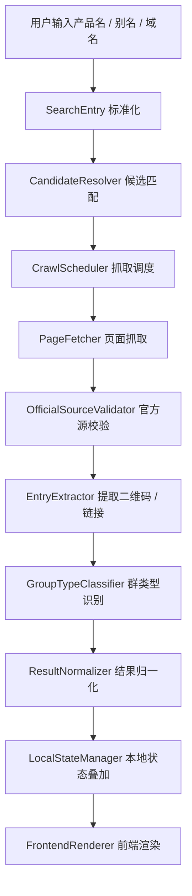

# 1. 系统概述

[引用：产品总纲 §1，§11]

### 1.1 产品定位

AI群聊发现器是一个本地运行、面向内部调研的官方群发现工具。系统的核心目标不是构建完整社区平台，而是在单用户环境中，以尽量低的人力成本定位 AI 产品的官方群入口。

### 1.2 核心流程（8 步）

系统必须严格遵循产品总纲定义的 8 步流程，不增删步骤：

| 步骤 | 名称 | 目标 |
|------|------|------|
| Step 1 | 搜索流程 | 接收用户输入的产品名、别名或域名 |
| Step 2 | 页面抓取流程 | 并行抓取官网与 GitHub 官方页面 |
| Step 3 | 官方源识别 | 过滤掉非官方页面和不可信入口 |
| Step 4 | 二维码 / 链接提取 | 定位官方群二维码或官方群入口链接 |
| Step 5 | 群类型识别 | 将群归类为 5 个固定枚举之一 |
| Step 6 | 结果归一化 | 统一生成前端可消费的产品卡片结构 |
| Step 7 | 本地状态存储 | 合并已添加状态并应用隐藏逻辑 |
| Step 8 | 弱更新机制 | 记录本次验证时间并返回当前结果 |

```text
Step 1: 用户输入产品名 / 别名 / 域名
    ↓
Step 2: 并行抓取官网首页、footer / contact / community、GitHub 组织主页、README
    ↓
Step 3: 识别官网或 GitHub 官方来源，剔除非官方页面
    ↓
Step 4: 提取二维码图片或官方群入口链接
    ↓
Step 5: 根据周边文案识别群类型
    ↓
Step 6: 归一化为主卡片 + 子群结构
    ↓
Step 7: 叠加本地“已添加”状态，应用隐藏逻辑
    ↓
Step 8: 记录最近验证时间，返回当前最新结果
```

补充说明：
- 当前 8 步主流程只覆盖“产品名 / 别名 / 域名”的正式搜索链路。
- 后续若增加“推荐关键词”能力，应作为 Step 1 之前的扩展入口，不并入当前 8 步主流程。
- 推荐关键词的默认扩展路径为：推荐词生成 → 候选产品映射 → 复用 Step 1~8。

---

# 2. 模块拆分

### 2.1 模块列表

| 模块名 | 英文名 | 职责 | 输入 | 输出 |
|--------|--------|------|------|------|
| 搜索入口 | SearchEntry | 接收并标准化查询词 | 产品名 / 别名 / 域名 | 标准化查询对象 |
| 候选匹配器 | CandidateResolver | 处理产品名歧义并生成候选产品 | 标准化查询对象 | 候选产品列表 |
| 抓取调度器 | CrawlScheduler | 按优先级组织并发抓取任务 | 目标产品信息 | 待抓取 URL 列表 |
| 页面抓取器 | PageFetcher | 获取静态 HTML 或动态渲染结果 | URL | 页面内容与元数据 |
| 官方源校验器 | OfficialSourceValidator | 校验页面是否属于官网或 GitHub 官方范围 | 页面内容与来源信息 | 官方页面集合 |
| 入口提取器 | EntryExtractor | 提取二维码或官方群入口链接 | 官方页面集合 | 原始群入口集合 |
| 群类型识别器 | GroupTypeClassifier | 依据周边文案识别群类型 | 入口上下文文本 | 群类型枚举 |
| 结果归一化器 | ResultNormalizer | 生成统一的产品卡片与群条目结构 | 原始入口集合 + 产品元数据 | `ProductCard[]` |
| 本地状态管理器 | LocalStateManager | 读写已添加状态与历史搜索词 | 卡片结果 + 本地状态 | 带状态的结果列表 |
| 前端渲染层 | FrontendRenderer | 将归一化结果映射为页面组件 | `ProductCard[]` | 页面 UI |

### 2.2 后续扩展模块（不纳入当前 MVP 实现）

| 模块名 | 英文名 | 职责 | 输入 | 输出 |
|--------|--------|------|------|------|
| 推荐关键词生成器 | KeywordSuggestionGenerator | 生成可点击的探索型推荐词 | 预置词库 / 热门源 / 规则 | 推荐词列表 |
| 推荐词映射器 | KeywordToCandidateResolver | 将推荐词扩展为候选产品集合 | 推荐词 | 候选产品列表 |

约束说明：
- 以上扩展模块仅作为后续能力预留，不应改写当前正式搜索入口定义。
- 推荐词命中后必须继续复用既有官方群发现链路，不得绕过官方源校验。

### 2.2 模块边界说明
- 候选匹配器只负责“产品是谁”，不负责页面抓取。
- 入口提取器只负责“哪里有群入口”，不负责“是不是官方群”。
- 群类型识别器只输出 5 个固定枚举值，不扩展自定义类型。
- 本地状态管理器只处理单用户本地状态，不承担多人同步。

---

# 3. 数据流

### 3.1 整体数据流图



### 3.2 关键数据结构

```typescript
type Platform = "微信" | "QQ" | "飞书";
type GroupType = "交流群" | "答疑群" | "售后群" | "招募/内测群" | "未知";

interface ProductCard {
  productId: string;
  appName: string;
  description: string;
  githubStars: number | null;
  createdAt: string | null;
  verifiedAt: string;
  groups: OfficialGroup[];
}

interface OfficialGroup {
  groupId: string;
  platform: Platform;
  groupType: GroupType;
  entry: GroupEntry;
  isAdded: boolean;
  sourceUrls: string[]; // 仅内部记录，不向用户展示
}

type GroupEntry = QRCodeEntry | LinkEntry;

interface QRCodeEntry {
  type: "qrcode";
  imagePath: string;
  fallbackUrl?: string;
}

interface LinkEntry {
  type: "link";
  url: string;
  note: "二维码暂未抓取成功";
}
```

### 3.3 展示层映射规则
- `ProductCard` 对应一个主卡片。
- `groups[0]` 作为折叠态默认展示的官方群预览。
- `groups` 全量列表用于展开态展示。
- 主卡片面向用户仍只暴露产品总纲定义的 7 个字段；`platform` 与 `sourceUrls` 仅用于筛选和内部处理。

---

# 4. 搜索流程（详细）

[引用：产品总纲 §5，§8，§11]

### 4.1 搜索入口处理

输入标准化规则：
- 产品名：直接作为主查询词。
- 英文别名 / 常见别名：进入候选匹配器，映射到可能的正式产品。
- 官网域名：优先反查产品主站与 GitHub 官方组织。

正式触发规则：
- 用户按 Enter；
- 用户点击搜索按钮；
- 用户在候选列表中选中某个候选产品。

约束：
- 输入过程可用于更新候选提示；
- 输入过程本身不直接触发正式抓取与页面抓取。

后续扩展约束：
- “推荐关键词”不是当前默认搜索输入。
- 后续若启用推荐词入口，应先将推荐词映射到候选产品，再进入当前搜索入口处理。
- 推荐词本身不得直接进入二维码提取阶段，更不能直接全网搜索二维码。

### 4.2 抓取源优先级

| 优先级 | 来源 | 说明 |
|--------|------|------|
| P1 | 官网首页 | 最高优先级，最可能出现官方群入口 |
| P1 | 官网 footer / contact / community 页面 | 官方常见入口承载位置 |
| P1 | GitHub 组织主页 | 官方组织页常用于挂社区入口 |
| P1 | GitHub 仓库 README | 官方仓库说明常包含社群信息 |
| P2 | 官方文档站 | 作为后续补充来源 |
| P2 | 官方招聘页 | 作为后续补充来源 |
| P2 | 官方公众号文章页 | 作为后续补充来源 |

### 4.3 歧义处理
- 候选匹配阶段最多返回 3 个候选产品。
- 候选项至少包含应用名称、简短描述、来源域名。
- 用户确认候选项后，才进入正式抓取流程。

### 4.4 结果排序
- 默认排序：
  1. 产品名匹配度
  2. 是否有明确官方群二维码
  3. GitHub stars
- 当用户选择“热门”时，使用 GitHub stars 重排。
- 当用户选择“最新”时，使用 `verifiedAt` 倒序重排。

### 4.5 后续扩展流程：推荐关键词入口（不纳入当前 MVP）

```text
首页推荐词 / 搜索框附近推荐词
    ↓
用户点击某个推荐词
    ↓
推荐词映射为候选产品集合
    ↓
对候选产品逐个复用当前搜索 / 抓取 / 提取流程
    ↓
输出现有 `ProductCard[]`
```

扩展约束：
- 推荐关键词入口只负责启动探索模式，不新增独立结果类型。
- 结果仍然必须来自官网或 GitHub 官方页面。
- 初版推荐词生成可基于规则、预置词库和热门源，不要求复杂推荐算法。

---

# 5. 抽取流程（详细）

[引用：产品总纲 §4，§5]

### 5.1 页面抓取

根据页面类型采用两类抓取方式：
- 静态页面：使用 HTTP 客户端直接抓取 HTML。
- 动态页面：使用浏览器自动化渲染后再提取 DOM。

页面抓取时同步记录：
- 请求 URL
- 最终跳转 URL
- 页面标题
- 抓取时间
- 页面文本摘要

### 5.2 官方源识别

官方源校验规则：
- 页面域名必须属于目标产品官网主域或 GitHub 官方组织 / 仓库。
- 页面内容需要与目标产品名称、品牌词或官方组织信息一致。
- 仅当页面同时满足“域名可信”和“主体可信”时，才进入后续提取流程。

### 5.3 二维码 / 链接提取

提取器按以下顺序工作：
1. 在页面中定位包含“交流”“社群”“答疑”“用户群”“开发者群”等关键词的文本块。
2. 在关键词周边 DOM 中搜索图片、二维码容器、按钮链接。
3. 若找到二维码图片，则下载并识别其可用性。
4. 若未找到二维码但找到官方群入口链接，则生成 `LinkEntry`，并附带固定提示“二维码暂未抓取成功”。

### 5.4 群类型识别

| 群类型 | 关键词示例 |
|--------|------------|
| 交流群 | 交流、社群、Community、Join us |
| 答疑群 | 答疑、Q&A、Support |
| 售后群 | 售后、客服、Help |
| 招募/内测群 | 招募、内测、Beta |
| 未知 | 以上均不命中 |

识别原则：
- 优先使用二维码或链接周边最近文本。
- 多个关键词冲突时，以最明确的群用途语义优先。
- 无法可靠归类时返回“未知”，不做主观推断。

---

# 6. 本地状态存储

[引用：产品总纲 §7，§11 Step 7，§12]

### 6.1 存储设计

MVP 采用本地单用户存储，不引入账号体系与远程数据库。推荐将本地状态与轻量抓取缓存都保存在本地 SQLite 中，理由如下：
- 可长期保存“已添加”状态，满足跨会话使用。
- 支持结构化查询，便于按群粒度保存状态。
- 与本地运行的抓取服务集成成本低。

### 6.2 建议表结构

| 表名 | 作用 | 关键字段 |
|------|------|----------|
| `added_groups` | 保存已添加群状态 | `group_id`, `product_id`, `added_at` |
| `search_history` | 保存最近搜索词 | `query`, `query_type`, `searched_at` |
| `crawl_snapshot` | 保存调试用抓取快照 | `product_id`, `source_url`, `captured_at`, `raw_html_path` |

### 6.3 存储规则
- “已添加”状态按群粒度保存，不按产品粒度保存。
- 搜索历史只用于本地辅助体验，不参与外部同步。
- 抓取快照仅用于排查抽取问题，不作为前端展示的数据源。

---

# 7. 弱更新机制

[引用：产品总纲 §11 Step 8]

### 7.1 设计原则
- 每次搜索都重新抓取线上页面，不依赖旧缓存直接展示结果。
- 每次成功识别到官方群入口时，刷新该结果的 `verifiedAt`。
- 为避免展示过期二维码，前端默认不回退展示旧结果快照。

### 7.2 处理流程

```text
用户发起搜索
    ↓
实时抓取官方页面
    ↓
若识别到官方群入口
    → 生成当前结果
    → 写入最近验证时间
    → 返回结果列表
    ↓
若本轮未识别到官方群入口
    → 返回空结果态
    → 不用旧二维码结果冒充最新结果
```

### 7.3 与“最近验证时间”的关系
- `verifiedAt` 只代表“本次搜索成功抓到官方群入口的时间”。
- `verifiedAt` 不承诺二维码一定仍然有效，只用于表达结果新鲜度。

---

# 8. 技术栈选取

### 8.1 推荐技术栈

在当前 MVP 场景下，推荐采用本地 Web 工具形态：

| 层级 | 技术选型 | 选型理由 |
|------|----------|----------|
| 前端 | React + Vite + TypeScript | 开发速度快，适合内部工具快速迭代 |
| 本地服务层 | FastAPI | 轻量、易于承载抓取与本地 API |
| 静态抓取 | `httpx` + `BeautifulSoup4` | 适合解析官网与 README 文本内容 |
| 动态抓取 | Playwright | 处理 JS 渲染页面与延迟加载内容 |
| 二维码识别 | OpenCV `QRCodeDetector` | 依赖相对简单，适合本地识别二维码 |
| 本地存储 | SQLite | 单用户、持久化、结构清晰 |

### 8.2 依赖建议

```text
frontend/
  - react
  - vite
  - typescript

backend/
  - fastapi
  - uvicorn
  - httpx
  - beautifulsoup4
  - playwright
  - opencv-python
  - sqlite3（Python 标准库）
```

### 8.3 设计约束
- 不引入付费第三方 API 作为 MVP 前提。
- 不引入远程数据库与鉴权服务。
- 技术栈选择必须优先服务“本地运行、低门槛、可快速验证”的目标。
